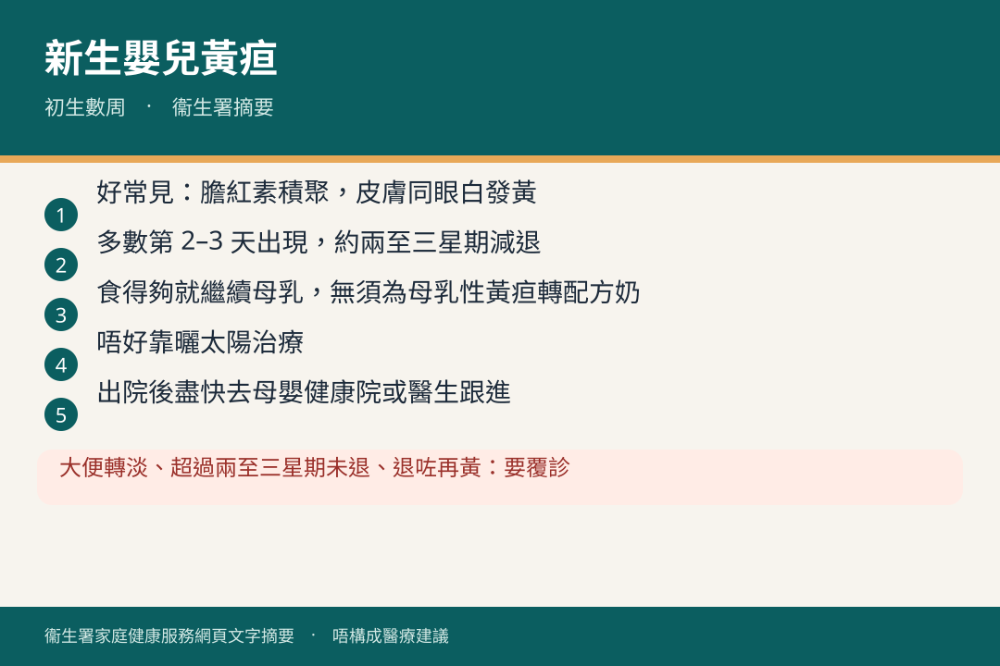
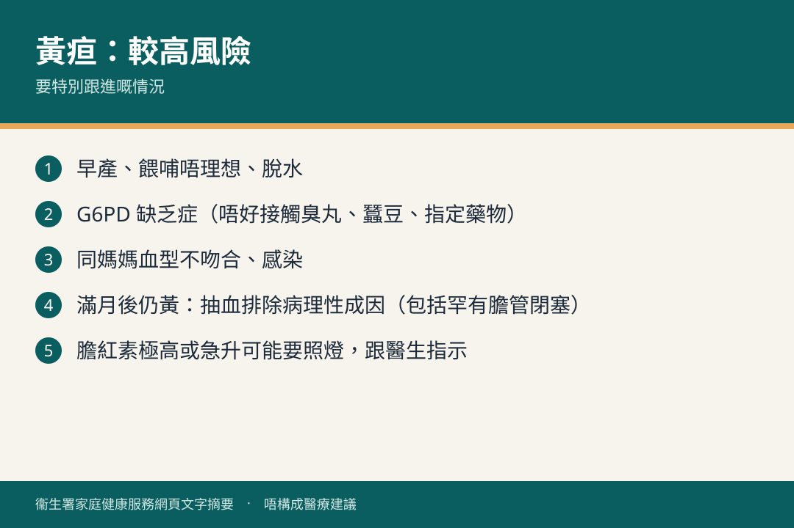

# 新生嬰兒黃疸

## 資訊圖

圖内文字根據衞生署家庭健康服務網頁整理，**唔構成醫療建議**。

## 適用年齡

初生數周至約兩至三個月（母乳性黃疸可較耐）。

## 重點摘要

- 黃疸好常見：紅血球分解產生膽紅素，初生肝未成熟處理唔切，皮膚同眼白發黃。
- 一般第 2–3 天出現，約兩至三星期肝功能跟上就減退。
- 大多數唔影響健康；但膽紅素極高可損害腦部。
- **唔好靠曬太陽治療**。食得夠就繼續母乳，無須為「母乳性黃疸」轉配方奶。
- 出院後盡快去母嬰健康院或家庭／兒科醫生跟進。

## 詳細說明

### 邊啲情況膽紅素會較高

早產、餵哺唔理想、G6PD 缺乏症、同媽媽血型不吻合、感染。

### 家長可以做咩

- 確保奶量足夠，避免脫水（睇大小便數量同質量）。
- 出院後 1–2 天內按指示覆診。
- 唔好額外餵白開水、葡萄糖水或（無需要時）配方奶。

### 要唔要醫

好多嬰兒無須治療，隨肝成熟會退。膽紅素過高或急升先要入院，例如光線治療（照燈）。

### 母乳性黃疸

部分食母乳寶寶黃疸持續較耐，通常兩至三個月內自然消退，一般較輕微，對健康同腦部發展唔構成影響，**無須轉配方奶**。持續黃疸亦可能有病理性成因（包括罕有但嚴重嘅膽管閉塞），所以滿月後仍有黃疸會安排抽血檢查。

### G6PD 缺乏症

遺傳病。公立醫院初生會驗臍帶血，陽性通常出院前通知。紅血球喺食某啲中西藥、接觸臭丸、食蠶豆等情況會大量分解，造成嚴重黃疸。

## 注意事項

以下要見醫生或回母嬰健康院：

- 大便顏色轉淡
- 黃疸持續超過兩至三星期
- 退咗之後再出現

## 參考來源

- [新生嬰兒黃疸](https://www.fhs.gov.hk/tc_chi/health_info/child/15666.html)
- [共享育兒樂（一）小冊子](https://www.fhs.gov.hk/tc_chi/health_info/child/30032.pdf)（FHS-CH5B）
