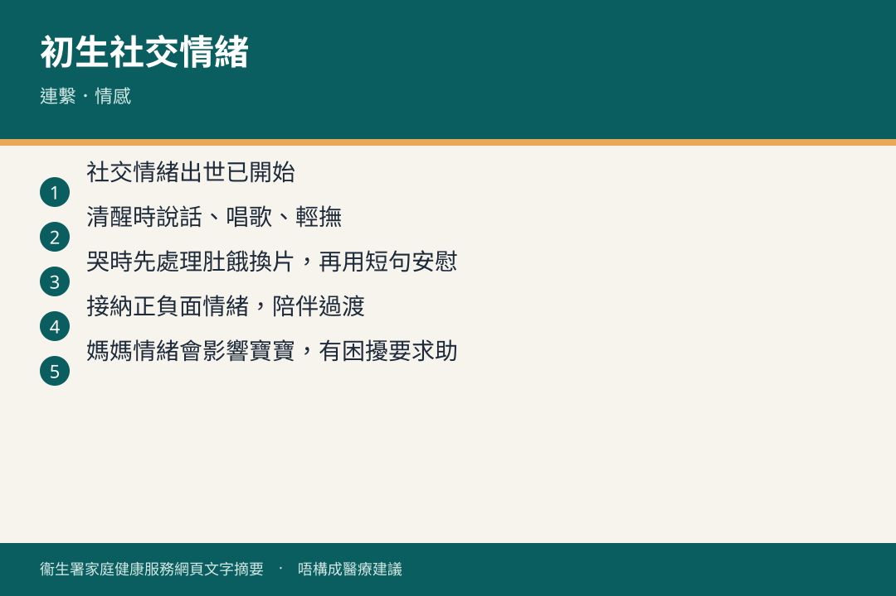

# 初生至一個月 · 親職／社交情緒

## 資訊圖

圖内文字根據衞生署家庭健康服務網頁整理，**唔構成醫療建議**。

## 適用年齡

出生至約滿月（社交情緒單張亦寫到 6 個月，呢頁只摘首月）。

## 重點摘要

- 社交情緒由出世已開始：情緒認知、自我管理、社交互動。
- 寶寶大部分時間瞓，情緒變化未好明顯，但已能分辨媽媽聲音，喜歡肌膚接觸。
- 清醒時說話、唱歌、輕撫；哭嘅時候除咗處理生理需要，可以用短句安慰。
- 接納正負面情緒，陪伴過渡；唔好靠逃避或壓抑。唔使擔心「會寵壞」。

## 詳細說明

| BB 會 | 家長可以 |
|--------|----------|
| 適應外界、多數時間瞓、除咗哭情緒變化唔明顯；認得媽媽聲音、喜歡肌膚之親 | 清醒時多講、唱、輕撫。哭時回應肚餓／換片等，亦可以講「好唔舒服」「肚餓咗」「媽媽喺度」 |

小冊子（二）仲有：嬰兒啼哭、了解寶寶信號、貼心照顧建立感情、常見皮膚問題、髖關節發育不良、揹帶／推車／汽車束縛設備。詳見 [30033](https://www.fhs.gov.hk/tc_chi/health_info/child/30033.html)。

媽媽情緒會影響寶寶。有困擾見 [產後情緒](../mother/postnatal-mental-health.md)。

## 參考來源

- [連繫．情感（初生至六個月）](https://www.fhs.gov.hk/tc_chi/health_info/child/30155.html)
- [共享育兒樂（二）](https://www.fhs.gov.hk/tc_chi/health_info/child/30033.html)
