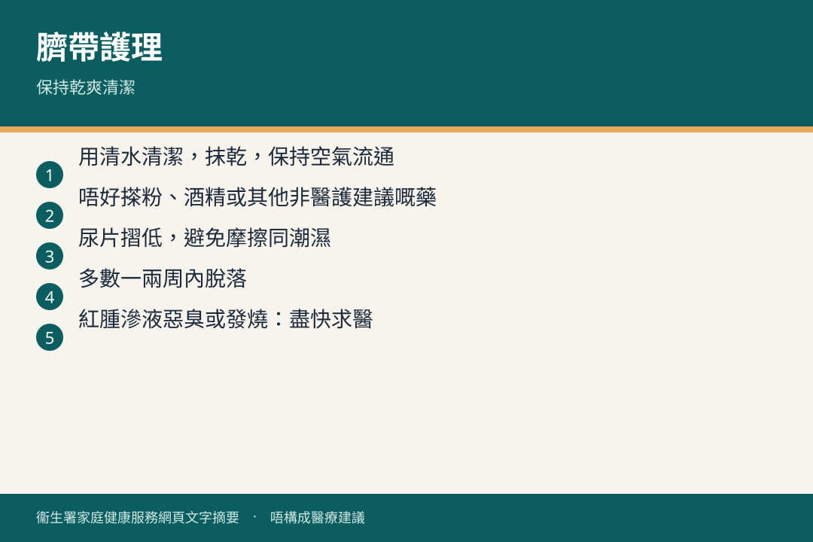

# 臍帶護理

## 資訊圖

圖内文字根據衞生署家庭健康服務網頁整理，**唔構成醫療建議**。

## 適用年齡

初生至臍帶脫落後數天（一般出生後 5–10 天，部分可長達三星期或更耐）。

## 重點摘要

- 保持**清潔同乾爽**。有較多分泌物（沐浴或換片後）就要清潔底部。
- 用**涼開水 + 棉花棒**輕抹底部，每抹一次換一支新棉花棒；最後先抹臍帶本身。
- **唔好**包紮、塗油膏臍粉膠布；尿片放喺臍帶下面，唔好包太緊。
- 酒精清潔可能令臍帶更耐先脫；涼開水同消毒劑對減感染分別唔明顯。

## 詳細說明

### 清潔步驟

1. 洗手，預備涼開水同棉花棒。
2. 露出肚臍。棉花棒沾涼開水，輕輕抹臍帶底部（同肚皮連接位），然後棄掉。
3. 重複至底部完全清潔，再用同一方法抹臍帶部分。
4. 輕柔，勿用力，以免受損或出血。
5. 換片時盡量將尿片置於臍帶下，避免磨擦出血。

### 脫落之後

少量血水染尿片屬常見，繼續用涼開水清潔至完全乾爽；約兩至三天傷口癒合就唔會再滲。剛脫落有少量滲血或分泌物都正常。

## 注意事項

盡早去母嬰健康院或家庭醫生：

- 底部皮膚紅腫、有臭味或異常分泌物
- 肚臍長出肉粒（肉芽）
- 啼哭時臍帶或肚臍凸出

**大量出血：立即去急症室。**

示範短片：[替初生寶寶清潔臍帶](https://www.fhs.gov.hk/tc_chi/mulit_med/000003.html)

## 參考來源

- [臍帶護理](https://www.fhs.gov.hk/tc_chi/health_info/child/15669.html)（2026 年 2 月修訂）
- [替初生寶寶清潔臍帶（影片劇本）](https://www.fhs.gov.hk/tc_chi/mulit_med/000003.html)
