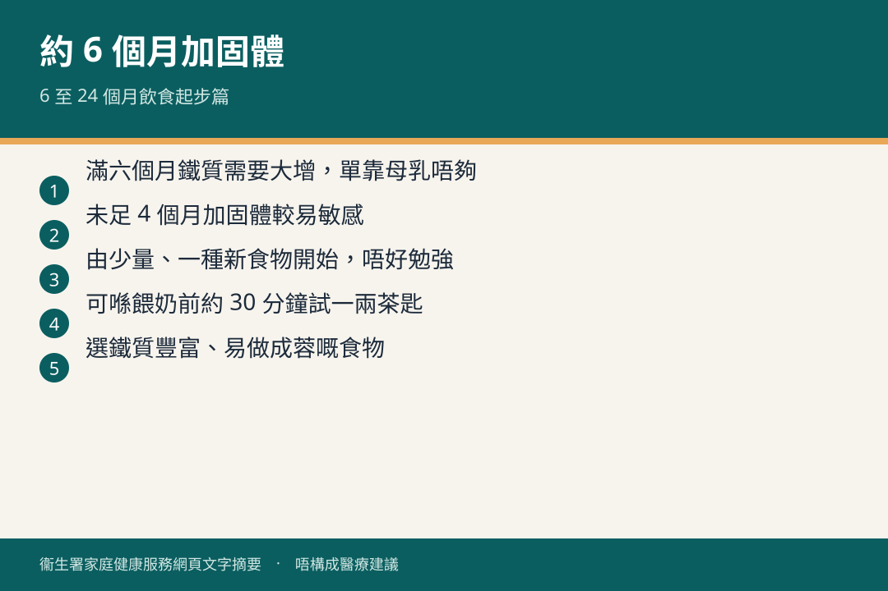

# 6 個月以上 · 開始固體食物

## 資訊圖

圖内文字根據衞生署家庭健康服務網頁整理，**唔構成醫療建議**。

## 適用年齡

約 6 個月起（衞生署《6 至 24 個月嬰幼兒健康飲食》）。

## 重點摘要

- 世界衞生組織／衞生署：首 6 個月全奶；**約 6 個月**逐漸加固體食物；繼續母乳至 2 歲或以上。
- 滿六個月後鐵質需要大增，單靠母乳唔夠。
- 未足 4 個月加固體較易敏感，亦會減少食母乳。
- 由少量、一種新食物開始；唔好勉強。

## 詳細說明

### 點開始

- 可喺餵奶前約 30 分鐘試固體；起初一兩茶匙，適應後先加量，再以母乳或配方奶補足。
- 選鐵質豐富、易做成蓉嘅食物；適應幼滑糊之後，試較稠質感。
- 嬰兒穀物粉：跟包裝用溫開水、母乳或配方奶調成幼滑糊。
- 從家人食材揀多樣食物（穀物、菜、果、蛋、肉、魚）；每次只試一種新食物、由少量開始。
- 吐出或不願意食，數日後再試。
- 食母乳嘅寶寶：衞生署建議每天 10 微克維他命 D 補充劑（見官方單張）。

### 講座

母嬰健康院常有「引進固體食物」線上講座，見 [resources/public-talks.md](../resources/public-talks.md)。

## 注意事項

呢頁係從衞生署飲食單張摘錄，未覆蓋 6–24 個月全套（推進、茶點、一歲飲食）。要完整步驟請睇官方頁。

## 參考來源

- [6 至 24 個月嬰幼兒健康飲食（起步篇）](https://www.fhs.gov.hk/tc_chi/health_info/child/14727.html)
- [母乳餵哺](https://www.fhs.gov.hk/tc_chi/health_info/child/12172.html)
