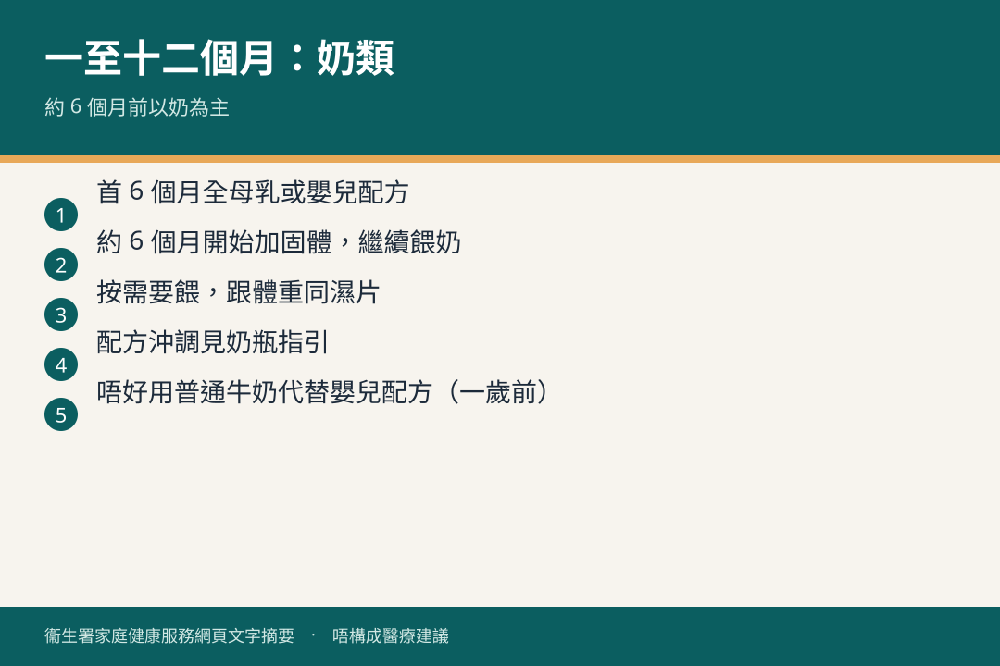

# 一至十二個月 · 奶類餵哺

## 資訊圖

圖内文字根據衞生署家庭健康服務網頁整理，**唔構成醫療建議**。

## 適用年齡

1–12 個月。約 6 個月加固體食物見 [feeding-solids.md](./feeding-solids.md)。

## 重點摘要

- **未滿 6 個月**：全母乳或只飲 **1 號**。唔好用 2 號／3 號。
- **6–12 個月**：繼續母乳或 1 號；轉 2 號並非必要。一歲以下唔好當奶飲鮮奶。
- 跟肚餓／食飽信號。參考分量只供對照，唔好迫飲光。
- 沖調 ≥70°C、先水後粉、2 小時內飲。步驟見 [奶瓶](../00-0-to-1-month/bottle-feeding.md)。

## 詳細說明

| 月齡 | 重點 |
|------|------|
| 1–2 個月 | 節奏漸穩，約 3–4 小時一次；配方每次約 60–90 毫升。每天約 550–970 毫升（約 1 個月參考） |
| 2–5 個月 | 每天約 630–1110 毫升。部分夜晚可連瞓 5–6 小時 |
| 6–12 個月 | 加固體後奶量按進食調整；仍然以母乳／1 號為主 |

滿一周大而每天濕透尿片少於六片，考慮脫水。母乳夠唔夠見 [初生 · 母乳](../00-0-to-1-month/breastfeeding.md)。

## 參考來源

- [奶瓶餵哺指引](https://www.fhs.gov.hk/tc_chi/health_info/child/12146.html)
- [有關寶寶飲用配方奶](../resources/formula-advice.md)
