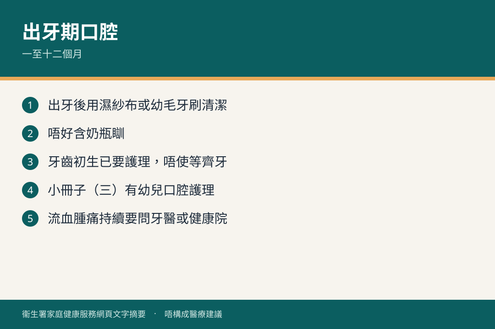

# 一至十二個月 · 口腔

## 資訊圖

圖内文字根據衞生署家庭健康服務網頁整理，**唔構成醫療建議**。

## 適用年齡

1–12 個月。

## 重點摘要

- 小冊子（三）有「幼兒口腔護理」。
- 唔好含住奶瓶瞓，減少日後蛀牙。
- 六歲以下家長系列見 [初生 · 口腔](../00-0-to-1-month/oral.md) 官方「牙齒俱樂部」。

## 參考來源

- [共享育兒樂（三）](https://www.fhs.gov.hk/tc_chi/health_info/child/30034.html)
- [口腔健康（初生至一個月目錄，系列共用）](https://www.fhs.gov.hk/tc_chi/health_info/class_life/child/child_bfm_oral.html)
