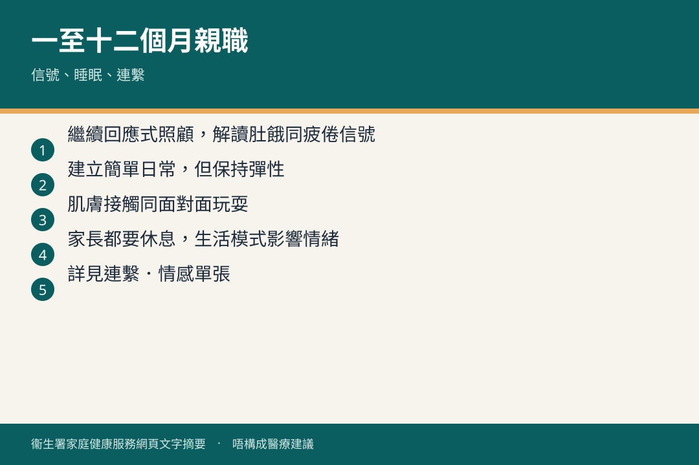

# 一至十二個月 · 親職

## 資訊圖

圖内文字根據衞生署家庭健康服務網頁整理，**唔構成醫療建議**。

## 適用年齡

1–12 個月。

## 重點摘要

小冊子（三）「一至十二個月」親職題目：

- 寶寶有話說：了解信號
- 連繫．情感（七至十二個月）
- 親子溝通：給一歲前嬰兒家長
- 搖籃曲之一：建立睡眠常規
- 搖籃曲之二：寶寶不肯睡
- 發燒護理；預防撲熱息痛意外中毒
- 你的 0–5 歲孩子需要電子屏幕產品嗎？
- 家長的健康生活模式

### 社交情緒（2–6 個月摘錄）

- **2–3 個月**：哭、咕咕聲、表情表達需要；會追看、聽聲笑、模仿表情。家長分辨唔同哭聲、目光交流、唔好急住逗笑。
- **4–6 個月**：聽名有反應；聽聲調分辨情緒。叫名、重複佢嘅聲音；留意自己聲調點樣影響寶寶。

詳見 [連繫．情感](https://www.fhs.gov.hk/tc_chi/health_info/child/30155.html)。

網上學習：[親子易點明](../resources/parent-child-elearning.md)　·　[講座](../resources/public-talks.md)

## 參考來源

- [共享育兒樂（三）](https://www.fhs.gov.hk/tc_chi/health_info/child/30034.html)
- [一至十二個月 · 親職教育](https://www.fhs.gov.hk/tc_chi/health_info/class_life/child/child_otm.html)
