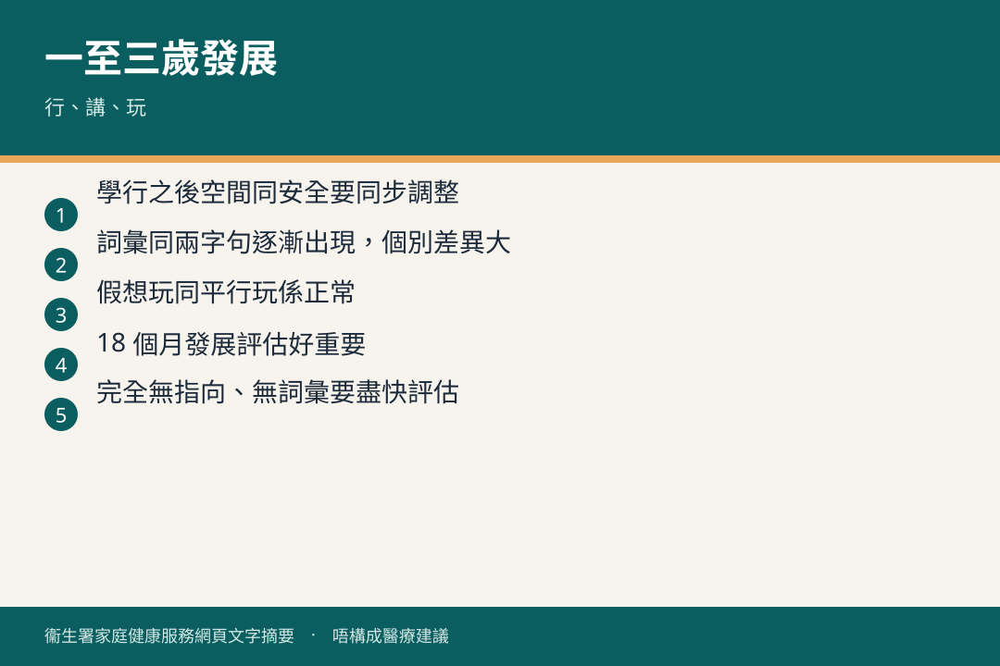

# 一歲至三歲 · 發展

## 資訊圖

圖内文字根據衞生署家庭健康服務網頁整理，**唔構成醫療建議**。

## 適用年齡

1–3 歲。

## 重點摘要

- 小冊子（三）：一至兩歲大兒童的發展；學說話；陪玩同講。
- 小冊子（四）：兩至三歲發展（見官方 30035 目錄）。
- 官方階段頁：[兒童發展](https://www.fhs.gov.hk/tc_chi/health_info/class_life/child/child_oty_child.html)
- 母嬰健康院繼續健康及發展監察。見 [ichip.md](../resources/ichip.md)。

有疑慮問母嬰健康院或兒科醫生，唔好自行同網上清單逐項對號入座就下定論。

## 參考來源

- [共享育兒樂（三）](https://www.fhs.gov.hk/tc_chi/health_info/child/30034.html)
- [一歲至三歲 · 兒童發展](https://www.fhs.gov.hk/tc_chi/health_info/class_life/child/child_oty_child.html)
