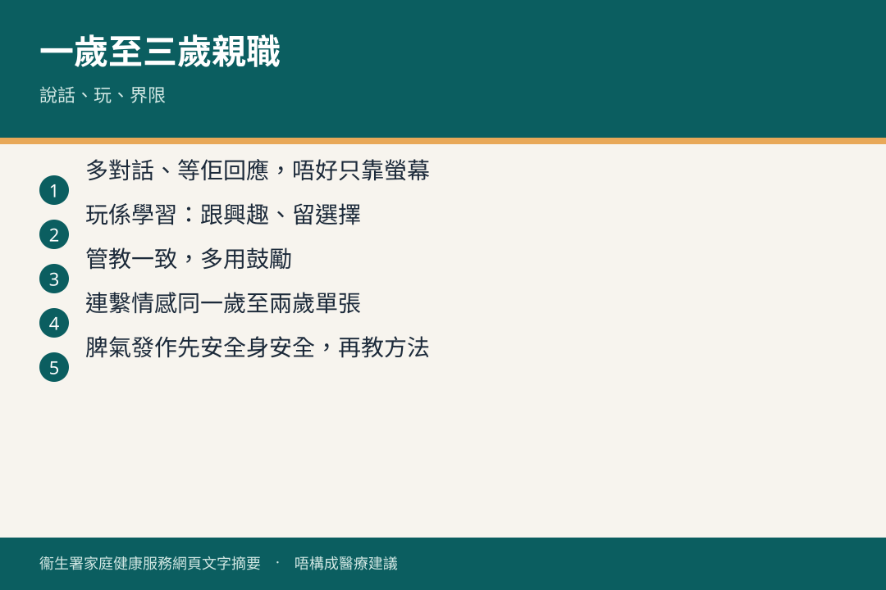

# 一歲至三歲 · 親職

## 資訊圖

圖内文字根據衞生署家庭健康服務網頁整理，**唔構成醫療建議**。

## 適用年齡

1–3 歲。

## 重點摘要

小冊子（三）「一至兩歲」：

- 連繫．情感（一歲至兩歲）
- 正面親職（一）：從小開始
- 幼兒學說話之一（一至兩歲）
- 陪我玩、同我講
- 0–5 歲要唔要電子屏幕；屏幕難避點揀
- 培育還是催谷
- 藥物安全

小冊子（四）完整目錄見 [booklets/04.md](../resources/booklets/04.md)，包括：學說話之二、語音發展、交朋友、正面親職（二）（三）、3P 課程、玩出創意、戒尿片、預備上學。

要訣見 [parenting-tips.md](../resources/parenting-tips.md)。

## 參考來源

- [共享育兒樂（三）](https://www.fhs.gov.hk/tc_chi/health_info/child/30034.html)
- [一歲至三歲](https://www.fhs.gov.hk/tc_chi/health_info/class_life/child/child_oty.html)
