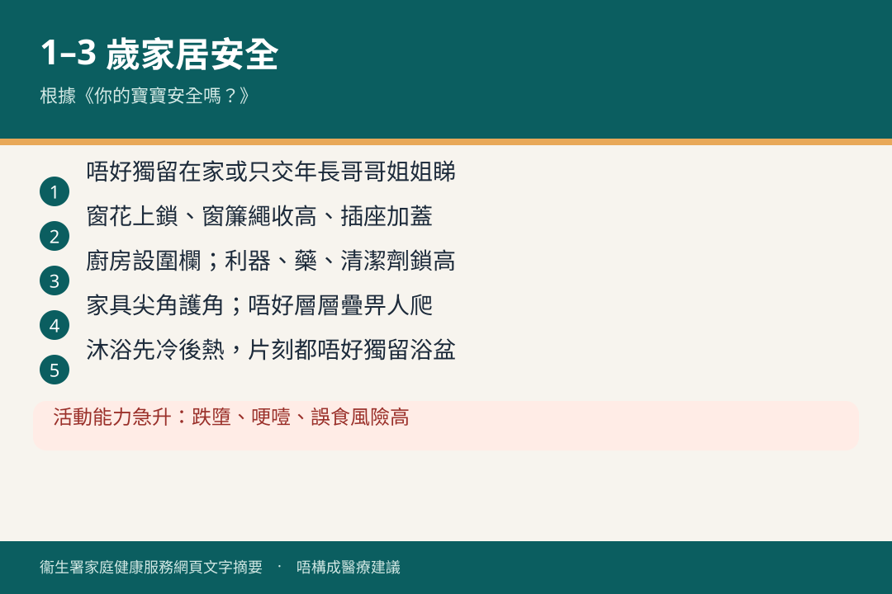

# 一歲至三歲 · 安全

## 資訊圖

圖内文字根據衞生署家庭健康服務網頁整理，**唔構成醫療建議**。

## 適用年齡

1–3 歲。

## 重點摘要

小冊子（三）有：

- 愛護兒童 慎防意外（一歲至三歲）
- 你的寶寶安全嗎？
- 智醒家長貼士：藥物安全

官方：[家居安全（一歲至三歲）](https://www.fhs.gov.hk/tc_chi/health_info/class_life/child/child_oty_home.html)

呢個年齡活動能力急升，跌墮、哽噎、藥物同清潔劑誤食風險高。睡眠仰睡原則對嬰兒期最關鍵；學行後重點轉去家居環境同出行。

## 參考來源

- [共享育兒樂（三）](https://www.fhs.gov.hk/tc_chi/health_info/child/30034.html)
