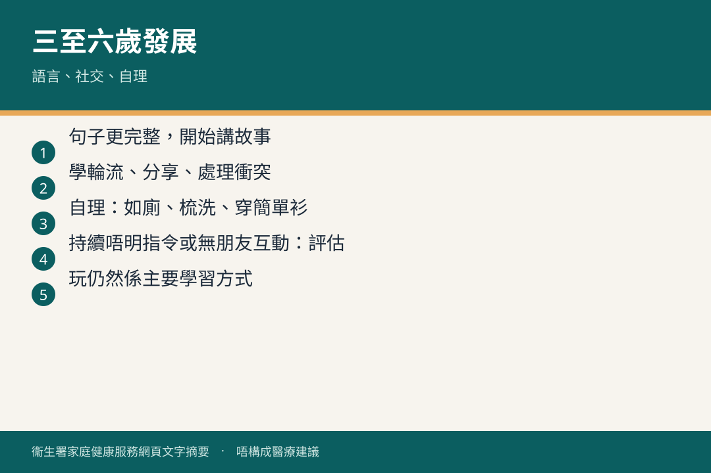

# 三歲至六歲 · 發展

## 資訊圖

圖内文字根據衞生署家庭健康服務網頁整理，**唔構成醫療建議**。

## 適用年齡

3–6 歲。

## 重點摘要

小冊子（五）：

- 兒童發展 8（上）— 三至四歲
- 兒童發展 8（下）— 四至六歲
- 連繫．情感（三至五歲）

官方：[兒童發展](https://www.fhs.gov.hk/tc_chi/health_info/class_life/child/child_tsy_child.html)

學前階段發展差距可以好大。持續倒退、語言或社交明顯困難，問家庭醫生、母嬰健康院或相關專業。

## 參考來源

- [共享育兒樂（五）](https://www.fhs.gov.hk/tc_chi/health_info/child/30036.html)
