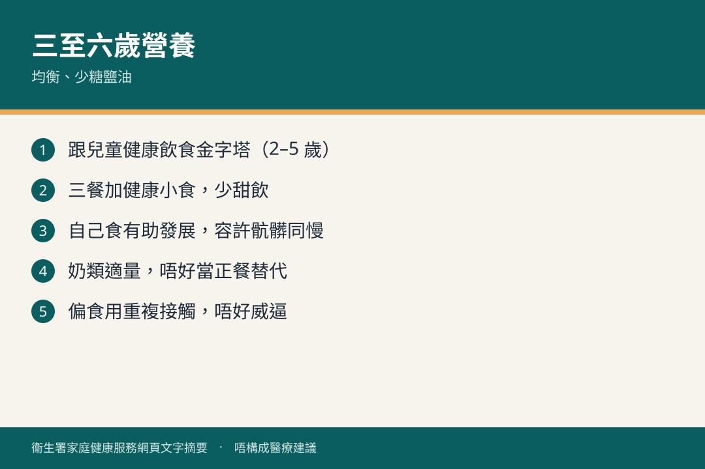

# 三歲至六歲 · 營養

## 資訊圖

圖内文字根據衞生署家庭健康服務網頁整理，**唔構成醫療建議**。

## 適用年齡

3–6 歲。

## 重點摘要

官方：[營養及健康生活習慣](https://www.fhs.gov.hk/tc_chi/health_info/class_life/child/child_tsy_nutrition.html)

一至十二個月營養頁提過：切細、坐定、慢慢食；食物標籤；防蚊驅避劑；飲品糖分。學前繼續均衡飲食、限制高糖飲品。奶類脂肪選擇見 [一歲後奶類](../02-1-to-3-years/feeding-milk.md)（二至五歲可低脂）。

## 參考來源

- [三歲至六歲](https://www.fhs.gov.hk/tc_chi/health_info/class_life/child/child_tsy.html)
- [一至十二個月 · 營養](https://www.fhs.gov.hk/tc_chi/health_info/class_life/child/child_otm_nutrition.html)
