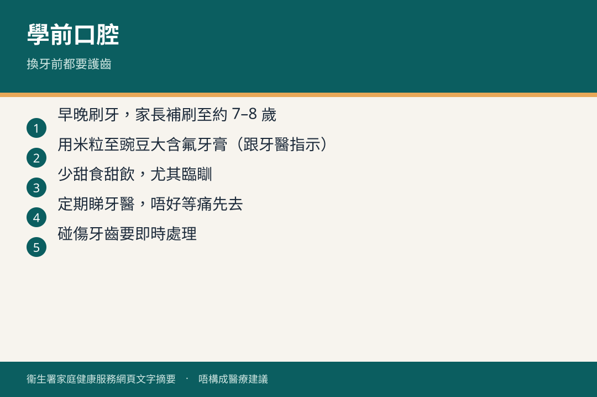

# 三歲至六歲 · 口腔

## 資訊圖

圖内文字根據衞生署家庭健康服務網頁整理，**唔構成醫療建議**。

## 適用年齡

3–6 歲（換牙期前後）。

## 重點摘要

官方口腔系列包括換牙、咬合、常見口腔疾病、碰傷、治療。見 [牙齒俱樂部](https://www.fhs.gov.hk/tc_chi/health_info/class_life/child/child_bfm_oral.html)。

定期睇牙、減少含糖零食、唔好含住飲品瞓。

## 參考來源

- [口腔健康（三歲至六歲）](https://www.fhs.gov.hk/tc_chi/health_info/class_life/child/child_tsy_oral.html)
