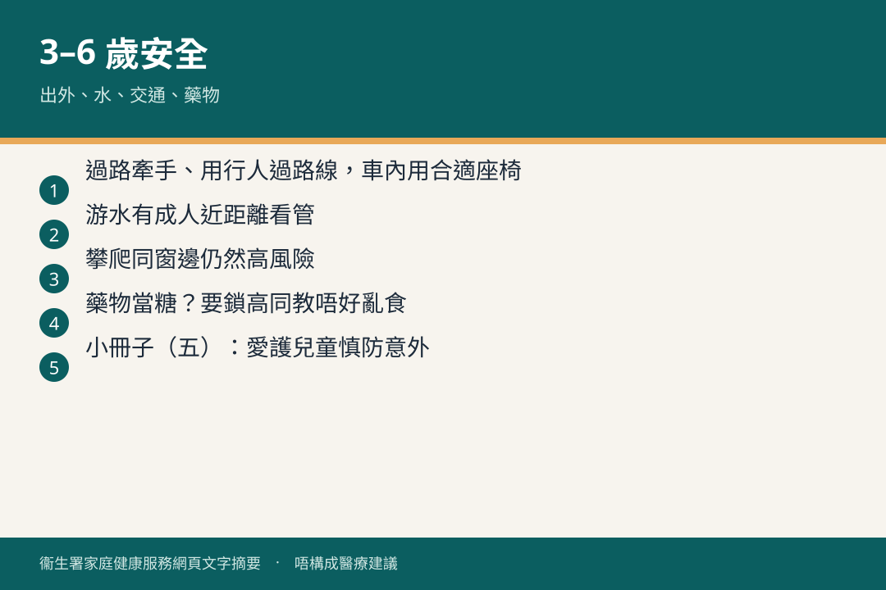

# 三歲至六歲 · 安全

## 資訊圖

圖内文字根據衞生署家庭健康服務網頁整理，**唔構成醫療建議**。

## 適用年齡

3–6 歲。

## 重點摘要

小冊子（五）：愛護兒童 慎防意外（三歲至五歲）。

官方：[家居安全](https://www.fhs.gov.hk/tc_chi/health_info/class_life/child/child_tsy_home.html)

呢個年齡出外、攀爬、交通、水安全同藥物存放仍然重要。

## 參考來源

- [共享育兒樂（五）](https://www.fhs.gov.hk/tc_chi/health_info/child/30036.html)
