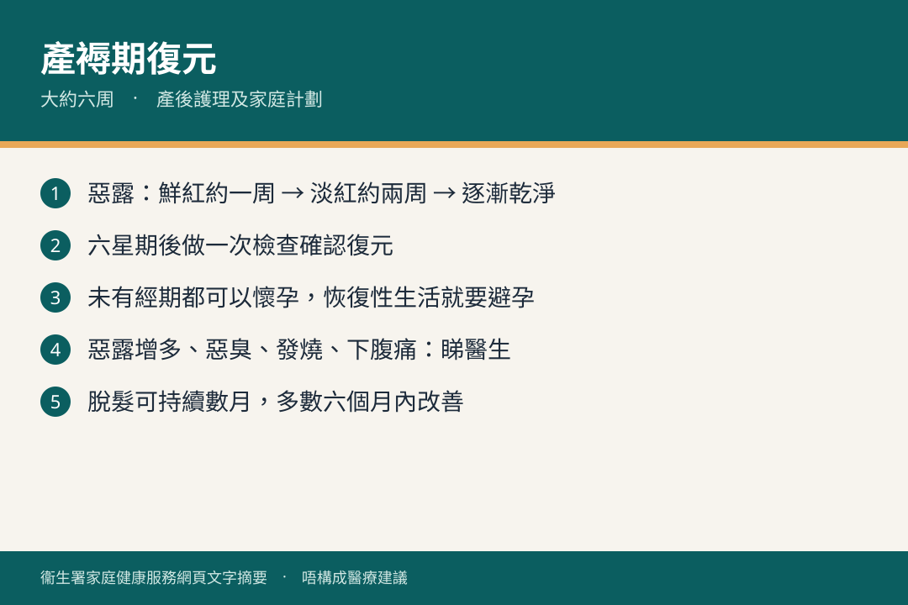

# 產後護理及家庭計劃

## 資訊圖

圖内文字根據衞生署家庭健康服務網頁整理，**唔構成醫療建議**。

## 適用年齡

產褥期（一般約六周）及之後。

## 重點摘要

- 產褥期約六周，身體器官回復懷孕前狀態；六星期後應做一次檢查，確認復元。
- 惡露：先鮮紅約一周 → 淡紅約兩周 → 白色分泌物漸漸減；乾淨通常兩至六周。
- 未有經期都可以懷孕；恢復性行為就要用可靠避孕方法。
- 惡露明顯增多、惡臭、發燒、下腹痛：要睇醫生。

## 詳細說明

### 惡露同經期

餵母乳可促進子宮收縮，縮短惡露時間。若只短暫餵母乳，停餵後惡露可能由淺紅／白色再轉鮮紅，然後再減。

無餵母乳：月經通常產後四至六周來。有餵母乳：通常較遲。

### 求醫情況

- 惡露量明顯增多、帶惡臭、發燒、下腹痛
- 尿頻同小便赤痛（產後較易尿道炎）
- 會陰傷口紅腫或裂開
- 剖腹傷口紅、腫、痛、熱或滲液
- 性交出血、疼痛或有困難

### 傷口

- 會陰：每次大小便後用花灑由前向後沖；勤換衞生巾。
- 剖腹：拆線後癒合正常可如常洗澡。

### 脫髮

懷孕時頭髮多處於生長期，產後轉休止期所以感覺甩得多。可持續四至二十周，通常六個月內不藥而癒。懷孕次數多，呢個現象會減少。

### 進補

原則係均衡飲食（五大類：奶類、肉魚蛋、蔬菜、水果、穀物），分量足夠就唔使刻意進補。中藥補品只應喺註冊中醫師指導下食，避免刺激性物質經母乳影響初生肝未成熟嘅寶寶。

### 性生活同避孕

產褥期後，惡露乾淨、子宮復原、傷口癒合、身心舒適，先恢復性生活。初期可能陰道乾澀或會陰輕微痛，多數數次後適應；避免過分劇烈同插入過深，以女方舒服為主導。一般唔會令已癒合傷口再裂。

首次排卵一般唔早於產後四周，但恢復性行為就要避孕。母嬰健康院可提供避孕意見。

## 注意事項

呢頁講媽媽身體復元，唔係嬰兒護理。健康院產後檢查、避孕預約、子宮頸普查見 [services.md](./services.md)。有疑問問母嬰健康院或醫生。

## 參考來源

- [產後護理及家庭計劃](https://www.fhs.gov.hk/tc_chi/health_info/woman/15692.html)
- [共享育兒樂（一）小冊子](https://www.fhs.gov.hk/tc_chi/health_info/child/30032.pdf)（FHS-MH11B）
