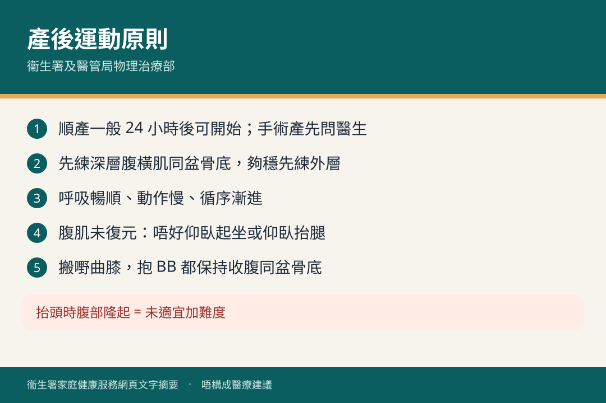
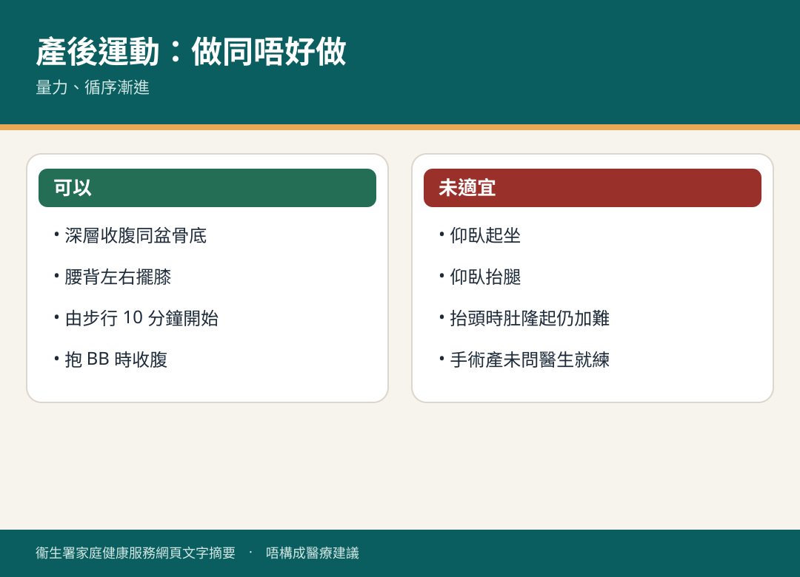

# 產後運動

## 資訊圖

圖内文字根據衞生署家庭健康服務網頁整理，**唔構成醫療建議**。

## 適用年齡

順產一般分娩 24 小時後；手術分娩要先問物理治療師或醫生。

## 重點摘要

- 懷孕令關節韌帶鬆、腹肌被拉；產後運動幫腹肌回復、預防腰背痛。
- 呼吸暢順、動作慢、量力、循序漸進、持之以恆。
- **先練深層腹橫肌同盆骨底**，夠穩先練外層。
- 腹肌未復元：**唔好**仰臥起坐或仰臥抬腿。
- 抱 BB、搬嘢、做家務都保持收緊腹肌同盆骨底。

## 詳細說明

（衞生署及醫管局物理治療部合編）

### 腰背

仰臥屈膝、腳掌平放；雙腳同時向左擺至膝盡量近墊，維持數秒再向右；重複數次。

### 強化腹肌

1. 輕輕呼吸放鬆腹部；呼氣時輕輕收緊下腹，同時收緊盆骨底；唔好閉氣，可以講話。維持數秒放鬆。逐漸加長至少數，最多持續 10 秒、重複 10 次。適應後可坐或企做。
2. 仰臥屈膝，收腹，收緊盆骨底同臀部令盆骨後傾、腰背貼墊。最多 10 秒，10 次一組，每天兩組。
3. 暢順後可收腹時抬頭，維持 5 秒，10 次一組、每天兩組。**抬頭時腹部隆起 = 未適宜**，繼續上一套。
4. 左右收腹：右肩向左膝、手觸左膝維持 5 秒；換邊。10 次一組、每天兩組。

### 恢復體能

由溫和開始，例如步行 10 分鐘，再加時間同強度。腹背夠穩先考慮跑步、跳躍。各人進度唔同。

可參加醫院物理治療部產後運動班。腹、背有問題問醫護。

### 護脊日常

搬嘢唔好彎腰，曲膝用大腿力企起。

## 注意事項

手術產、傷口未癒或疼痛，未諮詢前唔好自行加難度。

## 參考來源

- [產後運動](https://www.fhs.gov.hk/tc_chi/health_info/woman/15658.html)（2022 年 1 月修訂）
