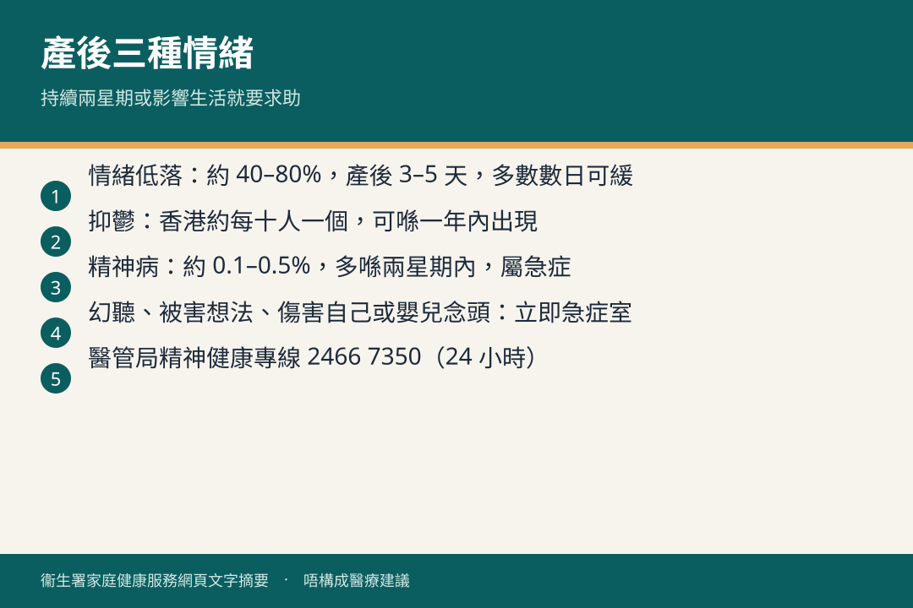

# 產後的情緒健康

## 資訊圖

圖内文字根據衞生署家庭健康服務網頁整理，**唔構成醫療建議**。

## 適用年齡

產後一年內（低落多喺首數天；抑鬱可喺六星期內或一年內；精神病多喺兩星期內）。

## 重點摘要

- 產後情緒問題風險較高；影響媽媽、家庭、伴侶，亦可能影響嬰兒身體、心智同行為發展。
- 三類：**產後情緒低落**（約 40–80%，輕微、數天可緩）、**產後抑鬱**（約 13–19%，持續超過兩星期要求助）、**產後精神病**（約 0.1–0.5%，急症，立即急症室）。
- 病徵持續多於兩星期、明顯影響日常生活：及早求助。
- 有自殘或傷害嬰兒念頭、幻聽、被害妄想：立即急症室或精神科。

## 詳細說明

### 風險因素

- 臨床：過去精神病、產前焦慮或抑鬱
- 心理社交：易焦慮性格、欠支援、伴侶或婆媳關係欠佳、家庭暴力、經濟困難、生活壓力
- 懷孕／生產／嬰兒：併發症、緊急剖腹、流產或難孕、意外或矛盾懷孕、嬰兒嚴重先天性疾病或早產

### 產後抑鬱主要病徵

大部分時間情緒持續低落（沮喪、無故哭或欲哭無淚）；對以往有興趣事物甚至對孩子失去興趣；食慾不振；失眠或早醒；經常疲倦缺活力；難集中同做決定；自責內疚、絕望；過分焦慮煩躁。

### 預防

懷孕前做好家庭同財務準備；對湊仔抱實際期望；參加講座工作坊；同其他家長建立支援；同伴侶家人溝通；托人幫手休息；抽時間散步或聯絡朋友；健康飲食、唔吸煙、避免酒精。

### 求助

- 致電所屬母嬰健康院，約護士評估同轉介
- 家庭醫生初步診斷，需要時轉專科
- 私人精神科醫生或臨床心理學家
- 專業社工或輔導員

**熱線**

- 醫院管理局精神健康專線（24 小時）：2466 7350
- 社會福利署 24 小時熱線：2343 2255
- 生命熱線：2382 0000
- 香港撒瑪利亞防止自殺會：2389 2222
- 家庭健康服務 24 小時：2112 9900

家人、伴侶點幫手，見 [她懷孕了](./partner-support.md)。

家庭醫生可經 [基層醫療指南](https://www.pcdirectory.gov.hk) 搜尋。

## 注意事項

產後精神病屬精神科急症，唔好等。

## 參考來源

- [產後的情緒健康](https://www.fhs.gov.hk/tc_chi/health_info/woman/14750.html)
- [共享育兒樂（一）小冊子](https://www.fhs.gov.hk/tc_chi/health_info/child/30032.pdf)（FHS-MH13B）
