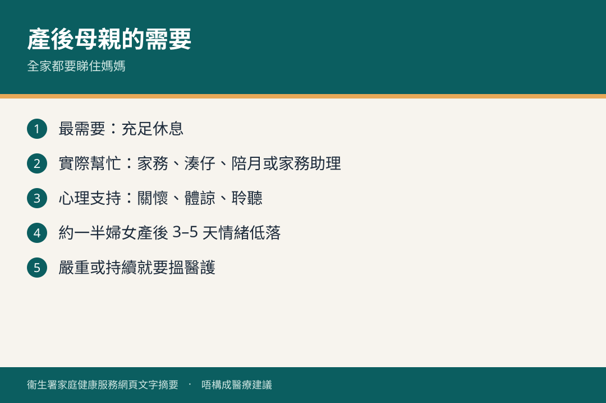

# 產後母親的需要

## 資訊圖

圖内文字根據衞生署家庭健康服務網頁整理，**唔構成醫療建議**。

## 適用年齡

產後初期（尤其首數天至數周）。

## 重點摘要

- 全家除咗湊 BB，都要睇住產後媽媽。
- 最需要：**充足休息**、實際幫忙（家務、湊仔、陪月／家務助理）、**心理支持**（關懷、體諒、聆聽）。
- 約一半婦女產後 3–5 天會情緒低落；休息加支持，多數數日內紓緩。嚴重或持續就要搵醫護。

## 詳細說明

分娩後荷爾蒙、角色轉變、湊仔壓力，令情緒較易不安、易哭、失眠、煩躁。伴侶或親人協助照顧嬰兒同家務，有助身體加快復元。

家庭健康服務有《共享育兒樂》小冊子、視聽教材、e 雜誌同公眾健康講座，幫家長同照顧者學育嬰技巧、加強親職信心。

想再了解情緒問題，見 [產後的情緒健康](./postnatal-mental-health.md)。家人角度見 [點照顧她的心](./partner-support.md)。生活模式見 [lifestyle.md](./lifestyle.md)。

## 注意事項

情況嚴重或持續，盡快向母嬰健康院或其他醫護人員求助。

## 參考來源

- [產後母親的需要](https://www.fhs.gov.hk/tc_chi/health_info/woman/30013.html)
