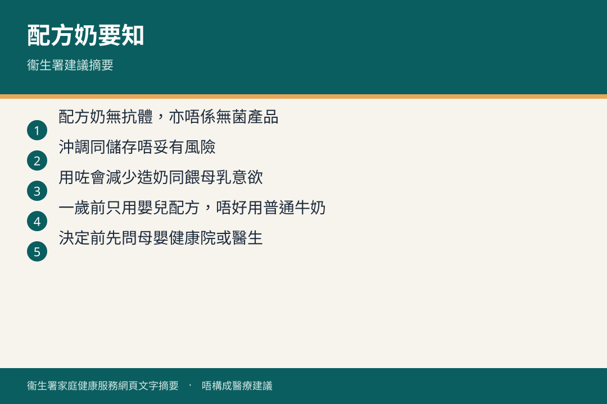

# 有關寶寶飲用配方奶的建議

## 資訊圖

圖内文字根據衞生署家庭健康服務網頁整理，**唔構成醫療建議**。

## 適用年齡

初生至幼兒（按年齡揀飲品）。

## 重點摘要

- 首 6 個月優先全母乳；未能或選擇不餵母乳時，**只可用嬰兒配方奶**替代。
- 一歲以下：**1 號**嬰兒配方奶；唔好飲鮮奶、羊奶、豆漿、淡奶、煉奶。
- 六個月後轉「2 號」**並非必要**。
- 一歲後奶只係飲食一部分；每天約 360–480 毫升已大致提供鈣質。普通鮮奶通常已足夠，唔使為「額外營養」買 3 號／4 號。
- 沖調用水唔低於 70°C。

## 詳細說明

（整理自小冊子內 FHS-N7B，2026 年 2 月重印）

### 一歲以下

- 出生至六個月：母乳係主要食糧。如用配方，選合適「1 號」。
- 六至十二個月：開始加固體食物後，可繼續同一品牌 1 號，或轉 2 號；**暫時無科學／醫學證據必須用較大嬰兒配方**。
- 用不低於 70°C 熱開水沖調（電熱水壺燒滾後放置唔超過 30 分鐘），殺掉奶粉有害細菌。
- 一歲以下唔應飲鮮奶。
- 轉牌子要用新牌子專用量匙，唔好混沖。

### 一歲或以上

- 幼兒已能從多樣固體食物攞營養；奶係獲取鈣質嘅其中一種來源。
- 每天約 360–480 毫升奶，大致應付每日鈣質。
- 可飲巴氏消毒鮮奶、UHT 鮮奶或全脂奶粉。家長**唔需要**為額外營養而用成長配方（3 號、4 號）；普通鮮奶通常較平。
- 鮮奶選擇（衞生署建議）：兩歲以下全脂；二至五歲可低脂；五歲或以上可脫脂。

## 注意事項

- 用配方奶後，寶寶食母乳意欲會減，媽媽造奶亦會減。
- 首年買奶粉開支可以好大，揀之前要知情考慮。
- 配方奶粉唔係無菌，處理唔妥可影響健康。詳見 [奶瓶餵哺指引](../00-0-to-1-month/bottle-feeding.md)。

## 參考來源

- [共享育兒樂（一）小冊子](https://www.fhs.gov.hk/tc_chi/health_info/child/30032.pdf)（FHS-N7B）
- [奶瓶餵哺指引](https://www.fhs.gov.hk/tc_chi/health_info/child/12146.html)
- [6 至 24 個月嬰幼兒健康飲食（起步篇）](https://www.fhs.gov.hk/tc_chi/health_info/child/14727.html)
