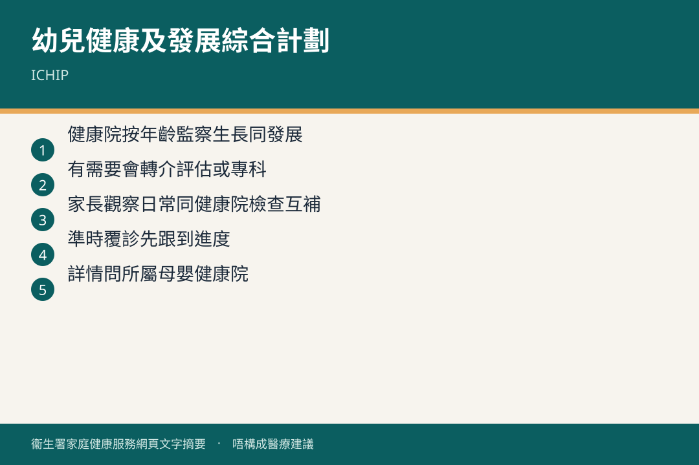

# 幼兒健康及發展綜合計劃

## 資訊圖

圖内文字根據衞生署家庭健康服務網頁整理，**唔構成醫療建議**。

## 適用年齡

妊娠期至學前（母嬰健康院跟進）。

## 重點摘要

母嬰健康院推行「幼兒健康及發展綜合計劃」，促進兒童全人健康：生理、認知、情緒、社交。三個核心：

1. **親職教育**
2. **免疫接種**
3. **健康及發展監察**

## 詳細說明

親職教育由妊娠期到學前，幫家長認識成長發展、更有信心扶育。途徑包括：

- 資料單張
- 預錄育兒常見問題
- 公眾健康講座同親職活動（一般廣東話）
- 網上資源
- 個別輔導

課題例子：兒童身心發展、母乳餵哺、嬰幼兒飲食營養、家居安全、口腔健康、親職輔導。

若兒童有初期行為問題，或父母管教有困難，可參加「3P 親子正策課程」（廣東話）。

免疫接種見 [接種疫苗](./vaccination.md)。健康及發展監察包括例行身體檢查、生長同發展跟進。

## 注意事項

服務以預約為主；首次登記見 [首次到母嬰健康院](../00-0-to-1-month/mchc-first-visit.md)。

## 參考來源

- [兒童健康服務](https://www.fhs.gov.hk/tc_chi/main_ser/child_health/child_health.html)
- [共享育兒樂（一）目錄](https://www.fhs.gov.hk/tc_chi/health_info/child/30032.html)
