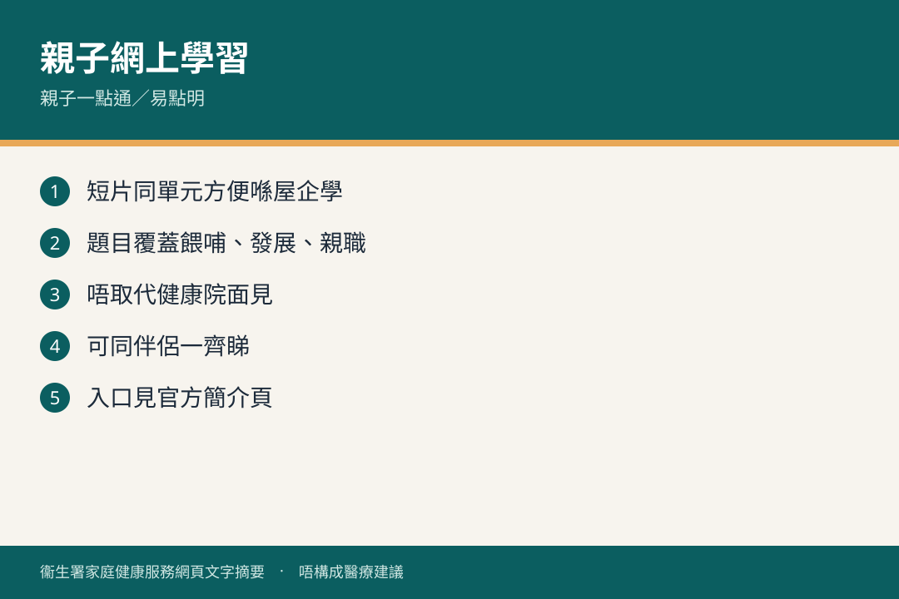

# 親子互動網上學習簡介

## 資訊圖

圖内文字根據衞生署家庭健康服務網頁整理，**唔構成醫療建議**。

## 適用年齡

由出世前後至學前（按登記孩子年齡推送）。

## 重點摘要

衞生署有兩套免費網上親子資源：

1. **親子一點通 e 雜誌**：簡單登記後，按孩子年齡定期電郵相關資訊，連到發展階段、溝通技巧、啟發潛能。
2. **親子易點明**：自助網上課程，按發展階段講育兒知識同親職技巧，有動畫、影片、互動遊戲；每階段完可做小測試攞證書。

## 詳細說明

對象包括家長、照顧者、同從事兒童服務嘅專業人士。目的係用自己節奏學習，加強照顧同教導信心，培育健康、快樂、適應力好嘅小孩。

登記同登入： [www.fhs.gov.hk](https://www.fhs.gov.hk) ，或向母嬰健康院查詢。

## 注意事項

- 網上教材係輔助，唔取代母嬰健康院個別輔導。
- 內容會更新，以網站最新版本為準。

## 參考來源

- [親子互動網上學習簡介](https://www.fhs.gov.hk/tc_chi/health_info/child/30046.html)（2022 年 2 月修訂，2026 年 2 月重印）
