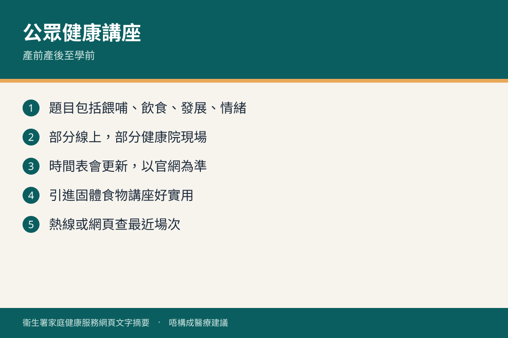

# 家庭健康服務公眾健康講座

## 資訊圖

圖内文字根據衞生署家庭健康服務網頁整理，**唔構成醫療建議**。

## 適用年齡

產前產後、嬰兒至學前（視乎講座題目）。

## 重點摘要

- 衞生署家庭健康服務定期辦公眾健康講座，多數以**線上**形式進行，部分提供**錄影重溫**。
- 題目分類包括：母乳餵哺、飲食營養、兒童發展／玩樂與學習、情緒健康和行為、健康生活習慣等。
- 熱門場次（例如貼心照顧及餵養寶寶、引進固體食物、一歲飲食、懷孕及哺乳媽媽飲食）經常**名額已滿**，宜早預約。

## 詳細說明

講座時間表會不時更新。近期例子（2026 年 7–8 月時間表所見）包括：

- 貼心照顧及餵養寶寶
- 引進固體食物（開始／推進）
- 如何照顧一歲孩子的飲食營養
- 懷孕及哺乳媽媽「適」飲「適」食
- 精明安排茶點
- 錄影講座（例如電子屏幕產品、孩子心急唔等得）

請以官方時間表為準，唔好靠本頁日期報名。

## 注意事項

- 講座以廣東話為主（兒童健康服務親職活動一般亦以廣東話進行）。
- 發燒、出疹或近期接觸傳染病者，唔好進入母嬰健康院場地。

## 參考來源

- [公眾健康講座時間表](https://www.fhs.gov.hk/tc_chi/main_ser/healthtalk_timetable.html)
- [共享育兒樂（一）目錄](https://www.fhs.gov.hk/tc_chi/health_info/child/30032.html)
