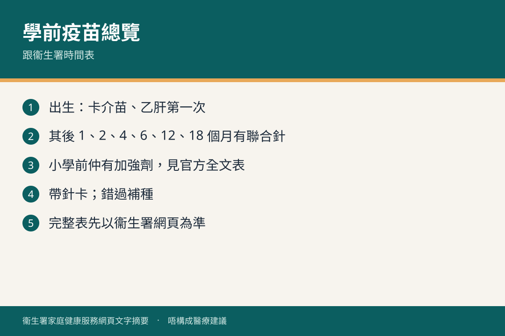

# 接種疫苗　預防傳染病

## 資訊圖

圖内文字根據衞生署家庭健康服務網頁整理，**唔構成醫療建議**。

## 適用年齡

初生起，並按香港兒童免疫接種計劃至小學。

## 重點摘要

- 疫苗令身體產生抗體，減低傳染病機會；多數人接種亦保護社區。
- 由初生開始，並按時打加強劑。
- 0–5 歲可去母嬰健康院；小學由衞生署到校注射；亦可選私家診所。
- 跟**通常居住地**嘅接種計劃；唔同國家計劃唔同。
- 妥善保存針卡。錯過要盡快補種。

## 詳細說明

公營系統跟衞生防護中心「疫苗可預防疾病科學委員會」建議嘅「香港兒童免疫接種計劃」，預防結核病、小兒麻痺、乙肝、白喉、百日咳、破傷風、肺炎球菌、水痘、麻疹、流行性腮腺炎、德國麻疹及子宮頸癌等。

### 計劃內時間表（2026 年 2 月單張）

| 年歲／年級 | 疫苗 |
|-------------|------|
| 初生 | 卡介苗；乙肝第一次 |
| 1 個月 | 乙肝第二次 |
| 2 個月 | 白喉、破傷風、無細胞型百日咳及滅活小兒麻痺混合疫苗第一次；肺炎球菌第一次 |
| 4 個月 | 上述混合疫苗第二次；肺炎球菌第二次 |
| 6 個月 | 上述混合疫苗第三次；乙肝第三次 |
| 12 個月 | 麻疹、流行性腮腺炎及德國麻疹混合疫苗第一次；肺炎球菌加強劑；水痘第一次 |
| 18 個月 | 上述四聯混合疫苗加強劑；麻疹、腮腺炎、德國麻疹及水痘混合疫苗第二次* |
| 小一 | 麻疹等混合疫苗第二次*；四聯混合疫苗加強劑 |
| 小五 | 人類乳頭瘤病毒疫苗第一次^ |
| 小六 | 減量四聯混合疫苗加強劑；HPV 第二次^ |

\* 2018 年 7 月 1 日或以後出生：18 個月喺母嬰健康院打 MMRV 第二次。2013 年 1 月 1 日至 2018 年 6 月 30 日出生：小一先打。  
^ 由 2019/20 學年起，合資格女學童小五打九價 HPV 第一次，小六第二次。

計劃以外（流感、Hib、腦膜炎雙球菌、輪狀病毒、甲肝、日本腦炎等）要問私家醫生。

### 可唔可以打

咳嗽或流鼻水但食、玩、休息、大便都正常：一般可打。發燒要先求醫，痊癒先打。

未必適合、要先由醫生決定：免疫力減退（先天失調、白血病或腫瘤、長期電療／化療／類固醇）、上次嚴重反應、對某抗生素或其他物質嚴重過敏、其他醫生認為不適宜。

### 接種後反應

常見輕微：低燒、煩躁、針口紅腫痛。可跟指示用退燒／止痛藥（**切勿阿斯匹靈**），或凍毛巾敷針口。持續或轉嚴重（高燒 40°C 或以上；24 小時後針口仍紅腫痛增加）要求診。

數分鐘至數小時內臉色蒼白、脈搏快、呼吸困難、紅疹甚至休克：立即急症室，並告知疫苗種類同日期。

## 注意事項

時間表會隨科學委員會建議更新，以衞生署最新公布為準。

## 參考來源

- [接種疫苗預防傳染病](https://www.fhs.gov.hk/tc_chi/health_info/child/14828.html)
- [共享育兒樂（一）小冊子](https://www.fhs.gov.hk/tc_chi/health_info/child/30032.pdf)（FHS-IM1B，2026 年 2 月）
